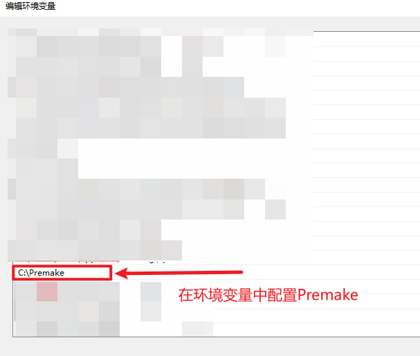
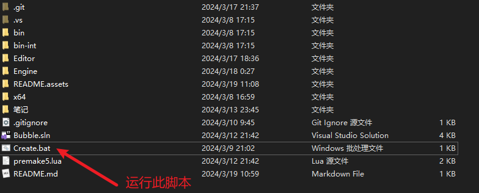
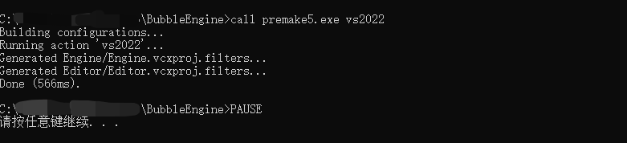

# BubbleEngine

## 项目构建

1.安装配置Premake

2.运行`Create.bat`脚本

3.项目构建成功

## 功能展示

### 运行效果

(GIF有点大,若没加载出可以多刷新几次)

### 渲染效果

(GIF有点大,若没加载出可以多刷新几次)

### 物体添加

(GIF有点大,若没加载出可以多刷新几次)

### 场景序列化

(GIF有点大,若没加载出可以多刷新几次)

