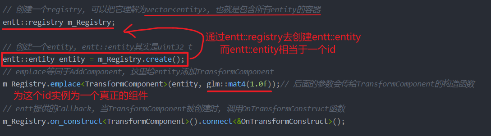
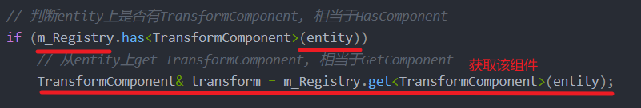
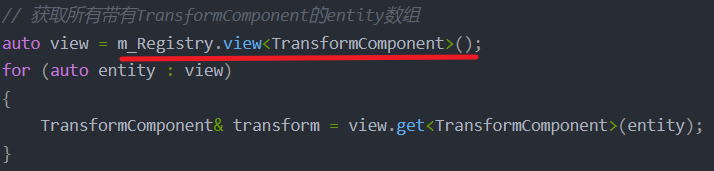
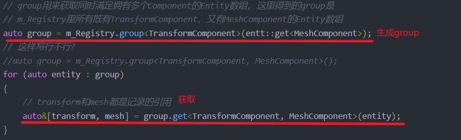

```C++
// 用于后面的Callback例子, 当Transform组件被创建时调用, 会加到entity上
static void OnTransformConstruct(entt::registry& registry, entt::entity entity){}

// 创建一个TransformComponent类
struct TransformComponent
{
	glm::mat4 Transform{ 1.0f };

	TransformComponent() = default;
	TransformComponent(const TransformComponent&) = default;
	TransformComponent(const glm::mat4 & transform)
		: Transform(transform) {}

	operator glm::mat4& () { return Transform; }
	operator const glm::mat4& () const { return Transform; }
};

// 创建一个registry, 可以把它理解为vector<entity>, 也就是包含所有entity的容器
entt::registry m_Registry;

// 创建一个entity, entt::entity其实是uint32_t
entt::entity entity = m_Registry.create();
// emplace等同于AddComponent, 这里给entity添加TransformComponent
m_Registry.emplace<TransformComponent>(entity, glm::mat4(1.0f));// 后面的参数会传给TransformComponent的构造函数

// entt提供的Callback, 当TransformComponent被创建时, 调用OnTransformConstruct函数
m_Registry.on_construct<TransformComponent>().connect<&OnTransformConstruct>();

// 判断entity上是否有TransformComponent, 相当于HasComponent
if (m_Registry.has<TransformComponent>(entity))
	// 从entity上get TransformComponent, 相当于GetComponent
	TransformComponent& transform = m_Registry.get<TransformComponent>(entity);

// 获取所有带有TransformComponent的entity数组
auto view = m_Registry.view<TransformComponent>();
for (auto entity : view)
{
	TransformComponent& transform = view.get<TransformComponent>(entity);
}

// group用来获取同时满足拥有多个Component的Entity数组, 这里得到的group是
// m_Registry里所有既有TransformComponent、又有MeshComponent的Entity数组
auto group = m_Registry.group<TransformComponent>(entt::get<MeshComponent>);
// 这样写行不行?
//auto group = m_Registry.group<TransformComponent, MeshComponent>();
for (auto entity : group)
{
	// transform和mesh都是记录的引用
	auto&[transform, mesh] = group.get<TransformComponent, MeshComponent>(entity);
}
```

## 实体类的创建



## 判断实体类是否有特定组件

### 判断单一实体是否有该组件



### 获取所有具有该组件的实体



## group

group用来获取同时满足拥有多个Component的Entity数组



