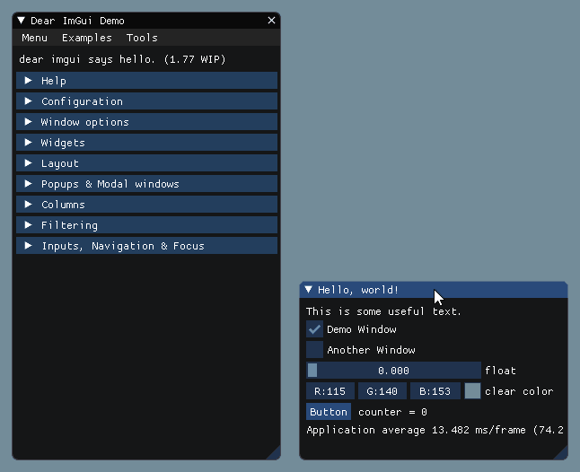
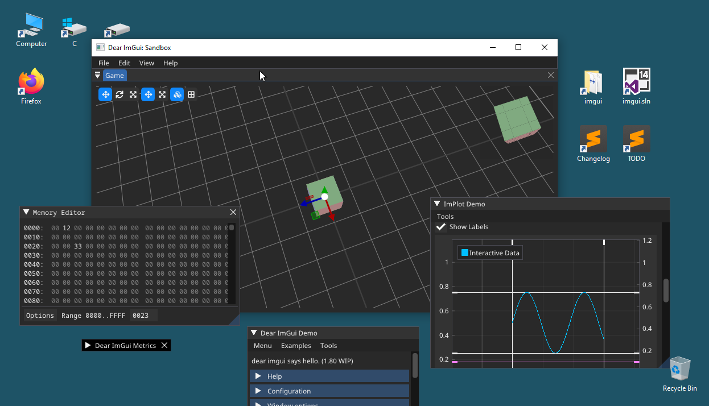

# 基本流程

## 在进入主循环前的准备工作:

1. 使用 `ImGui::CreateContext()`创建亲爱的 ImGui 上下文
2. (可选择)设置配置标志、加载字体和设置样式。
3. 初始化平台和渲染后端
   

## 主循环:

1. 主循环的开始：调用后端的`ImGui_ImplXXX_NewFrame（）`函数+调用`ImGui：：NewFrame（）`
   
2. 主循环结束：调用 `ImGui::Render()` + 调用渲染后端的渲染函数（例如 `ImGui_ImplDX11_Render()`）。
   

## 一些其他操作

1. 大多数后端需要一些额外步骤来挂钩或转发事件。(例如，调用 `ImGui_ImplWin32_WndProcHandler`)
2. 调用后台关闭函数，并使用 `ImGui::DestroyContext()`销毁亲爱的 ImGui 上下文。
3.  在应用程序的输入逻辑中：您可以轮询
    `ImGui::GetIO().WantCaptureMouse`/`WantCaptureKeyboard`，以检查 Dear ImGui 是否想要阻止来自底层应用程序的鼠标/键盘输入。例如，当悬停窗口时，`WantCaptureMouse` 将被设置为 true，一种可能的策略是停止向主应用程序传递鼠标事件。

# 官方GLFW + OpenGL实例

## 初始化

```C++
// Setup Dear ImGui context
IMGUI_CHECKVERSION();
ImGui::CreateContext();
ImGuiIO& io = ImGui::GetIO();
io.ConfigFlags |= ImGuiConfigFlags_NavEnableKeyboard;       // Enable Keyboard Controls
        //io.ConfigFlags |= ImGuiConfigFlags_NavEnableGamepad;      // Enable Gamepad Controls
        io.ConfigFlags |= ImGuiConfigFlags_DockingEnable;           // Enable Docking
        io.ConfigFlags |= ImGuiConfigFlags_ViewportsEnable;         // 启用多视口/平台窗口
        //io.ConfigFlags |= ImGuiConfigFlags_ViewportsNoTaskBarIcons;
        //io.ConfigFlags |= ImGuiConfigFlags_ViewportsNoMerge;

// Setup Platform/Renderer backends(后端)
ImGui_ImplGlfw_InitForOpenGL(YOUR_WINDOW, true);          // Second param install_callback=true will install GLFW callbacks and chain to existing ones.
ImGui_ImplOpenGL3_Init();
```

## 主循环中的Begin操作:

```C++
// (Your code calls glfwPollEvents())
// ...
// Start the Dear ImGui frame
ImGui_ImplOpenGL3_NewFrame();
ImGui_ImplGlfw_NewFrame();
ImGui::NewFrame();
ImGui::ShowDemoWindow(); // Show demo window! :)
```

## 主循环中的End操作:

```C++
// Rendering
// (Your code clears your framebuffer, renders your other stuff etc.)
ImGui::Render();
ImGui_ImplOpenGL3_RenderDrawData(ImGui::GetDrawData());
// (Your code calls glfwSwapBuffers() etc.)
```

## Shutdown:

```C++
ImGui_ImplOpenGL3_Shutdown();
ImGui_ImplGlfw_Shutdown();
ImGui::DestroyContext();
```

## 开启一些附加功能:

### Docking

```C++
io.ConfigFlags |= ImGuiConfigFlags_DockingEnable; 
```



###  Multi-viewports

```C++
io.ConfigFlags |= ImGuiConfigFlags_ViewportsEnable; 
```



除此之外，在渲染循环结束时，通常在渲染主视口之后，但在呈现/交换主视口之前：

```C++
// Update and Render additional Platform Windows
ImGui::UpdatePlatformWindows();
ImGui::RenderPlatformWindowsDefault();
```


# example_glfw_opengl3

```C++
// Dear ImGui: standalone example application for GLFW + OpenGL 3, using programmable pipeline
// (GLFW is a cross-platform general purpose library for handling windows, inputs, OpenGL/Vulkan/Metal graphics context creation, etc.)
// If you are new to Dear ImGui, read documentation from the docs/ folder + read the top of imgui.cpp.
// Read online: https://github.com/ocornut/imgui/tree/master/docs

#include "imgui.h"
#include "imgui_impl_glfw.h"
#include "imgui_impl_opengl3.h"
#include <stdio.h>
#if defined(IMGUI_IMPL_OPENGL_ES2)
#include <GLES2/gl2.h>
#endif
#include <GLFW/glfw3.h> // Will drag system OpenGL headers

// [Win32] Our example includes a copy of glfw3.lib pre-compiled with VS2010 to maximize ease of testing and compatibility with old VS compilers.
// To link with VS2010-era libraries, VS2015+ requires linking with legacy_stdio_definitions.lib, which we do using this pragma.
// Your own project should not be affected, as you are likely to link with a newer binary of GLFW that is adequate for your version of Visual Studio.
#if defined(_MSC_VER) && (_MSC_VER >= 1900) && !defined(IMGUI_DISABLE_WIN32_FUNCTIONS)
#pragma comment(lib, "legacy_stdio_definitions")
#endif

static void glfw_error_callback(int error, const char* description)
{
    fprintf(stderr, "Glfw Error %d: %s\n", error, description);
}

int main(int, char**)
{
    // Setup window
    glfwSetErrorCallback(glfw_error_callback);
    if (!glfwInit())
        return 1;

    // Decide GL+GLSL versions
#if defined(IMGUI_IMPL_OPENGL_ES2)
    // GL ES 2.0 + GLSL 100
    const char* glsl_version = "#version 100";
    glfwWindowHint(GLFW_CONTEXT_VERSION_MAJOR, 2);
    glfwWindowHint(GLFW_CONTEXT_VERSION_MINOR, 0);
    glfwWindowHint(GLFW_CLIENT_API, GLFW_OPENGL_ES_API);
#elif defined(__APPLE__)
    // GL 3.2 + GLSL 150
    const char* glsl_version = "#version 150";
    glfwWindowHint(GLFW_CONTEXT_VERSION_MAJOR, 3);
    glfwWindowHint(GLFW_CONTEXT_VERSION_MINOR, 2);
    glfwWindowHint(GLFW_OPENGL_PROFILE, GLFW_OPENGL_CORE_PROFILE);  // 3.2+ only
    glfwWindowHint(GLFW_OPENGL_FORWARD_COMPAT, GL_TRUE);            // Required on Mac
#else
    // GL 3.0 + GLSL 130
    const char* glsl_version = "#version 130";
    glfwWindowHint(GLFW_CONTEXT_VERSION_MAJOR, 3);
    glfwWindowHint(GLFW_CONTEXT_VERSION_MINOR, 0);
    //glfwWindowHint(GLFW_OPENGL_PROFILE, GLFW_OPENGL_CORE_PROFILE);  // 3.2+ only
    //glfwWindowHint(GLFW_OPENGL_FORWARD_COMPAT, GL_TRUE);            // 3.0+ only
#endif

    // Create window with graphics context
    GLFWwindow* window = glfwCreateWindow(1280, 720, "Dear ImGui GLFW+OpenGL3 example", NULL, NULL);
    if (window == NULL)
        return 1;
    glfwMakeContextCurrent(window);
    glfwSwapInterval(1); // Enable vsync

    // Setup Dear ImGui context
    IMGUI_CHECKVERSION();
    ImGui::CreateContext();
    ImGuiIO& io = ImGui::GetIO(); (void)io;
    io.ConfigFlags |= ImGuiConfigFlags_NavEnableKeyboard;       // Enable Keyboard Controls
    //io.ConfigFlags |= ImGuiConfigFlags_NavEnableGamepad;      // Enable Gamepad Controls
    io.ConfigFlags |= ImGuiConfigFlags_DockingEnable;           // Enable Docking
    io.ConfigFlags |= ImGuiConfigFlags_ViewportsEnable;         // Enable Multi-Viewport / Platform Windows
    //io.ConfigViewportsNoAutoMerge = true;
    //io.ConfigViewportsNoTaskBarIcon = true;

    // Setup Dear ImGui style
    ImGui::StyleColorsDark();
    //ImGui::StyleColorsClassic();

    // 启用视口后，我们会对 WindowRounding/WindowBg 进行调整，使平台窗口看起来与普通窗口相同。

    ImGuiStyle& style = ImGui::GetStyle();
    if (io.ConfigFlags & ImGuiConfigFlags_ViewportsEnable)
    {
        style.WindowRounding = 0.0f;
        style.Colors[ImGuiCol_WindowBg].w = 1.0f;
    }

    // Setup Platform/Renderer backends
    ImGui_ImplGlfw_InitForOpenGL(window, true);
    ImGui_ImplOpenGL3_Init(glsl_version);

    // Load Fonts
    // - If no fonts are loaded, dear imgui will use the default font. You can also load multiple fonts and use ImGui::PushFont()/PopFont() to select them.
    // - AddFontFromFileTTF() will return the ImFont* so you can store it if you need to select the font among multiple.
    // - If the file cannot be loaded, the function will return NULL. Please handle those errors in your application (e.g. use an assertion, or display an error and quit).
    // - The fonts will be rasterized at a given size (w/ oversampling) and stored into a texture when calling ImFontAtlas::Build()/GetTexDataAsXXXX(), which ImGui_ImplXXXX_NewFrame below will call.
    // - Read 'docs/FONTS.md' for more instructions and details.
    // - Remember that in C/C++ if you want to include a backslash \ in a string literal you need to write a double backslash \\ !
    //io.Fonts->AddFontDefault();
    //io.Fonts->AddFontFromFileTTF("../../misc/fonts/Roboto-Medium.ttf", 16.0f);
    //io.Fonts->AddFontFromFileTTF("../../misc/fonts/Cousine-Regular.ttf", 15.0f);
    //io.Fonts->AddFontFromFileTTF("../../misc/fonts/DroidSans.ttf", 16.0f);
    //io.Fonts->AddFontFromFileTTF("../../misc/fonts/ProggyTiny.ttf", 10.0f);
    //ImFont* font = io.Fonts->AddFontFromFileTTF("c:\\Windows\\Fonts\\ArialUni.ttf", 18.0f, NULL, io.Fonts->GetGlyphRangesJapanese());
    //IM_ASSERT(font != NULL);

    // Our state
    bool show_demo_window = true;
    bool show_another_window = false;
    ImVec4 clear_color = ImVec4(0.45f, 0.55f, 0.60f, 1.00f);

    // Main loop
    while (!glfwWindowShouldClose(window))
    {
        // Poll and handle events (inputs, window resize, etc.)
        // You can read the io.WantCaptureMouse, io.WantCaptureKeyboard flags to tell if dear imgui wants to use your inputs.
        // - When io.WantCaptureMouse is true, do not dispatch mouse input data to your main application.
        // - When io.WantCaptureKeyboard is true, do not dispatch keyboard input data to your main application.
        // Generally you may always pass all inputs to dear imgui, and hide them from your application based on those two flags.
        glfwPollEvents();

        // Start the Dear ImGui frame
        ImGui_ImplOpenGL3_NewFrame();
        ImGui_ImplGlfw_NewFrame();
        ImGui::NewFrame();

        // 1. Show the big demo window (Most of the sample code is in ImGui::ShowDemoWindow()! You can browse its code to learn more about Dear ImGui!).
        if (show_demo_window)
            ImGui::ShowDemoWindow(&show_demo_window);

        // 2. Show a simple window that we create ourselves. We use a Begin/End pair to created a named window.
        {
            static float f = 0.0f;
            static int counter = 0;

            ImGui::Begin("Hello, world!");                          // Create a window called "Hello, world!" and append into it.

            ImGui::Text("This is some useful text.");               // Display some text (you can use a format strings too)
            ImGui::Checkbox("Demo Window", &show_demo_window);      // Edit bools storing our window open/close state
            ImGui::Checkbox("Another Window", &show_another_window);

            ImGui::SliderFloat("float", &f, 0.0f, 1.0f);            // Edit 1 float using a slider from 0.0f to 1.0f
            ImGui::ColorEdit3("clear color", (float*)&clear_color); // Edit 3 floats representing a color

            if (ImGui::Button("Button"))                            // Buttons return true when clicked (most widgets return true when edited/activated)
                counter++;
            ImGui::SameLine();
            ImGui::Text("counter = %d", counter);

            ImGui::Text("Application average %.3f ms/frame (%.1f FPS)", 1000.0f / ImGui::GetIO().Framerate, ImGui::GetIO().Framerate);
            ImGui::End();
        }

        // 3. Show another simple window.
        if (show_another_window)
        {
            ImGui::Begin("Another Window", &show_another_window);   // Pass a pointer to our bool variable (the window will have a closing button that will clear the bool when clicked)
            ImGui::Text("Hello from another window!");
            if (ImGui::Button("Close Me"))
                show_another_window = false;
            ImGui::End();
        }

        // Rendering
        ImGui::Render();
        int display_w, display_h;
        glfwGetFramebufferSize(window, &display_w, &display_h);
        glViewport(0, 0, display_w, display_h);
        glClearColor(clear_color.x * clear_color.w, clear_color.y * clear_color.w, clear_color.z * clear_color.w, clear_color.w);
        glClear(GL_COLOR_BUFFER_BIT);
        ImGui_ImplOpenGL3_RenderDrawData(ImGui::GetDrawData());
    	
        // 更新和渲染附加平台 Windows
        // (平台函数可能会更改当前的 OpenGL 上下文，因此我们要保存/恢复它，以便于在其他地方粘贴这段代码。
        //  对于这个特定的演示应用程序，我们也可以直接调用 glfwMakeContextCurrent(window))
        if (io.ConfigFlags & ImGuiConfigFlags_ViewportsEnable)
        {
            GLFWwindow* backup_current_context = glfwGetCurrentContext();
            ImGui::UpdatePlatformWindows();
            ImGui::RenderPlatformWindowsDefault();
            glfwMakeContextCurrent(backup_current_context);
        }

        glfwSwapBuffers(window);
    }

    // Cleanup
    ImGui_ImplOpenGL3_Shutdown();
    ImGui_ImplGlfw_Shutdown();
    ImGui::DestroyContext();

    glfwDestroyWindow(window);
    glfwTerminate();

    return 0;
}
```

