## GLFW 数据的传递与获取

相当于一个全局的,我们需要获取到的信息

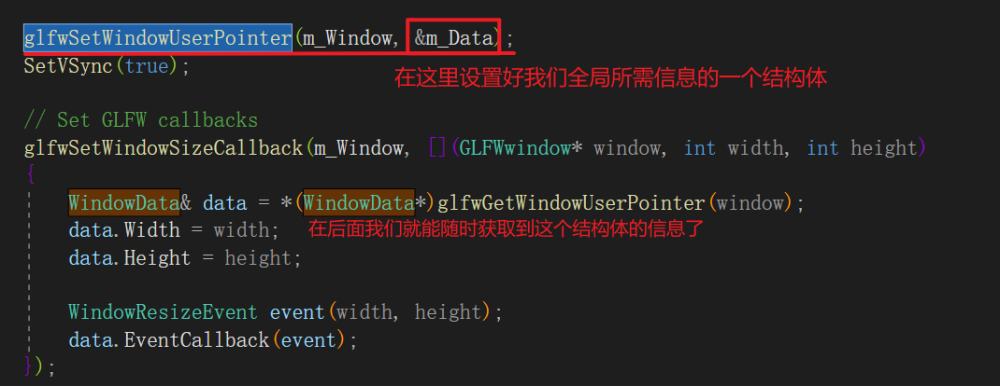

## Event事件以及层的理解

对于Window，我们有一个WindowData结构体记录了全局所需的数据，其中包括了一个回调函数的指针
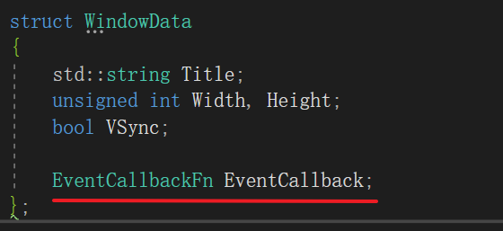

在进行Application初始化时，我们会绑定这个回调函数：
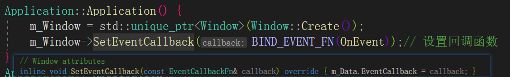

而所绑定的这个OnEvent所对应的实现为：
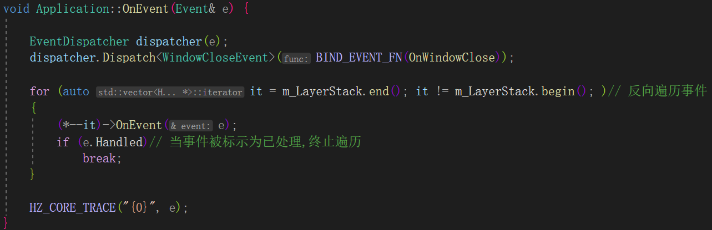
在这里我们会反向遍历所有的层，然后通过OnEvent方法去处理接下来传入的参数事件e

事件e是在回调函数时进行传入的
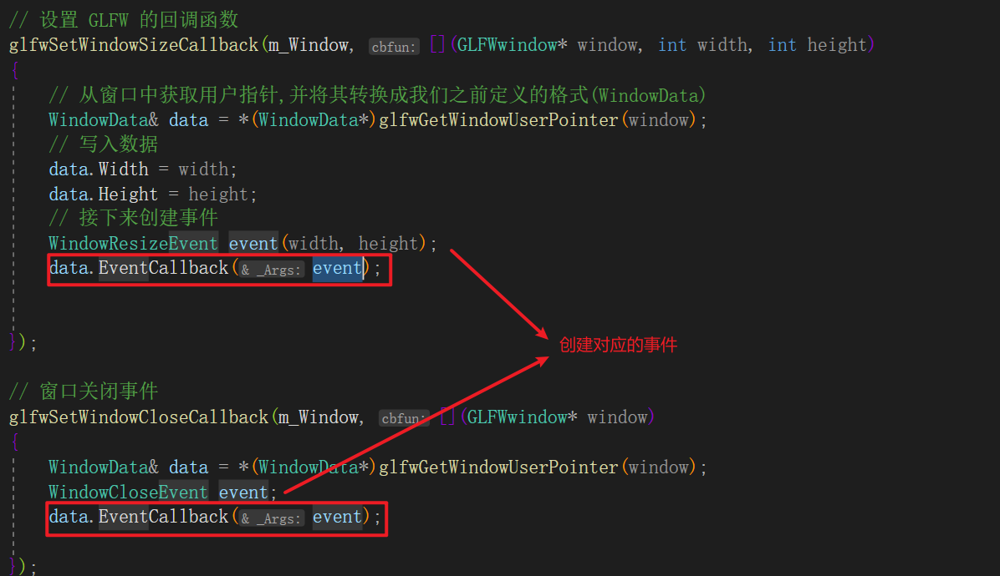

也就是说，在程序运行时触发回调函数后，我们首先会更新data的数据，然后生成相应的事件，并将这个事件传递给Application中的OnEvent方法，在Application的OnEvent方法中我们将反向遍历所有层级去处理这个由回调函数传回来的函数

层级的概念则指向的是我们在不同的层会进行不同的操作，相当于把逻辑分离开来。

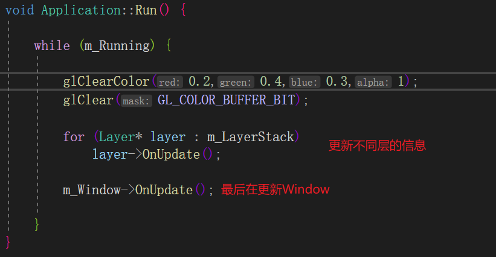

## EventDispatcher

EventDispatcher类如下:

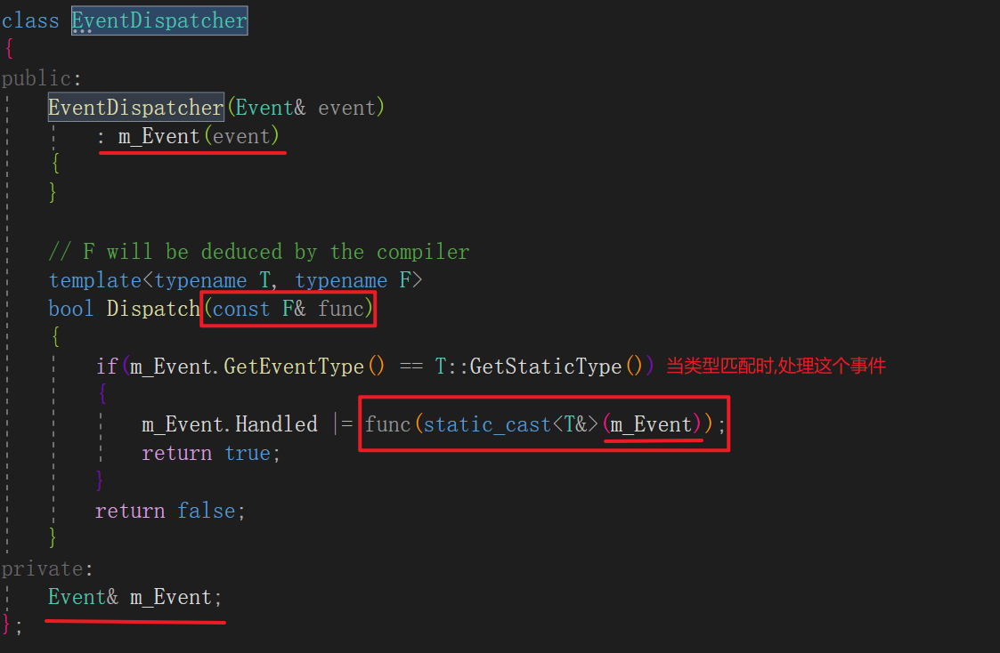

应用实例:
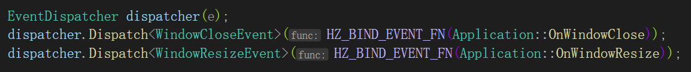

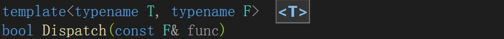
首先创建EventDispatcher，接下来调用Dispatch方法对事件进行判断，如果这个事件是我们想要处理的事件，我们就处理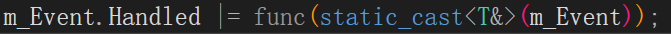。

## Render

在编辑器层中进行渲染逻辑的书写。

在Engine中封装OpenGL的信息

### OpenGL中将要使用的功能

- 各种全局配置
  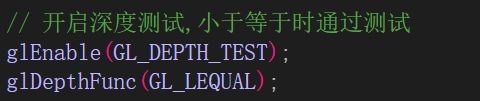
- 帧缓冲
- 渲染缓冲
- 着色器资源
- 纹理
- Shader数据传递

## Render逻辑

- 在初始化Application同时初始化Renderer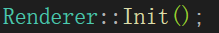
- 在进入到Run中的渲染循环中，通过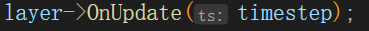
  进行渲染

### Renderer::Init

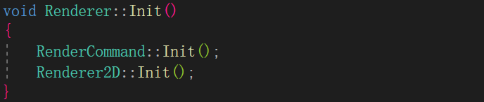
在此初始化上述二者

#### RenderCommand::Init()

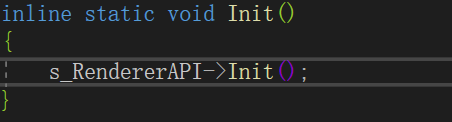
初始化了API，s_RendererAPI实例OpenGL对象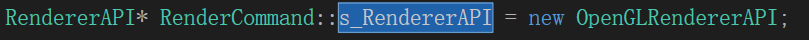
随后对OpenGL进行一个初始化，在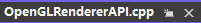中

#### Renderer2D::Init()

在此首先初始化Renderer2D内部数据s_Data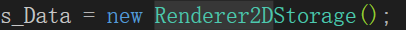。
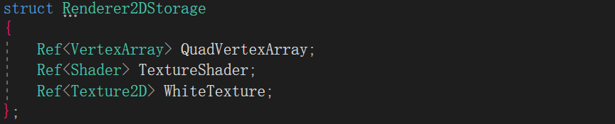

##### 初始化数据并创建VAO

随后创建s_Data->QuadVertexArray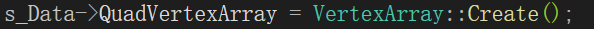。
同样，在创建VertexArray时我们会根据API返回不同的对象
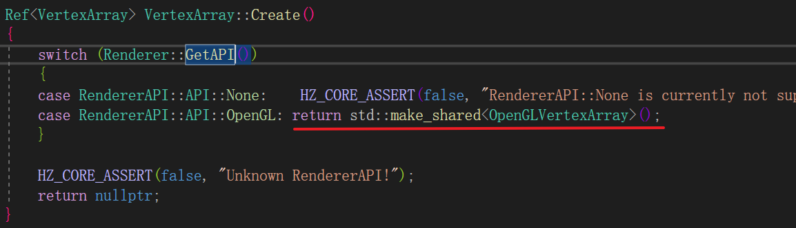
OpenGLVertexArray::OpenGLVertexArray()构造函数如下：
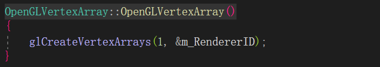
在此，我们创建了个VertexArray

##### 创建VBO

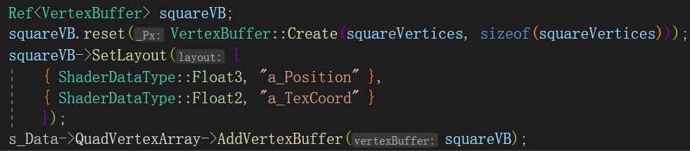
跟VAO相同，VBO依然时通过Create创建，并在此选择API去创建API对应的VBO
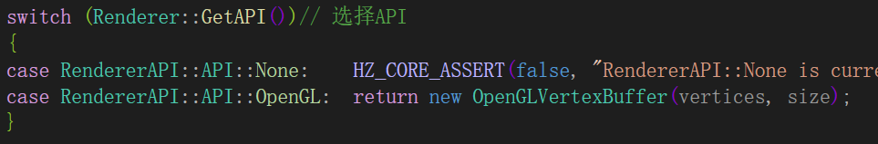
OpenGL下真正创建VBO，在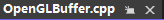里实现
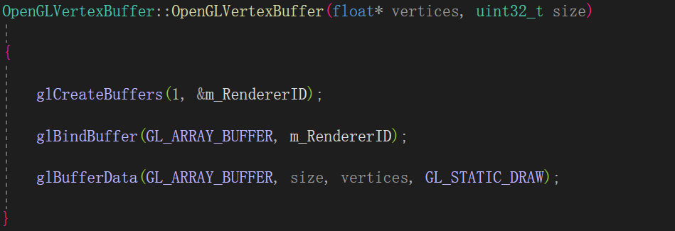

##### 绑定VAO&VBO

设置数据的布局
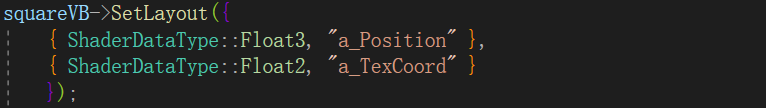
这里在进行创建时需要传递顶点数据
接下来为绑定VAO，VBO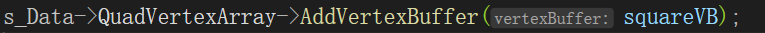
具体实现如下
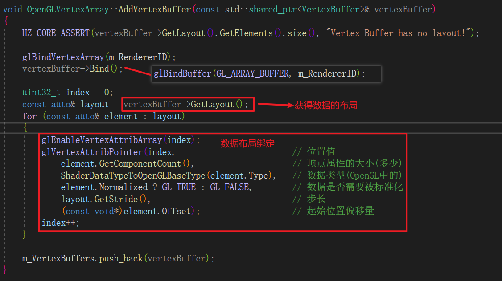

##### 创建IBO索引

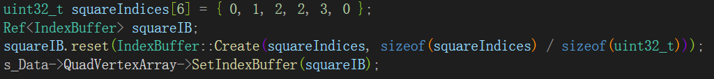
与VAO，VBO相同，依然是先Create一个实例来
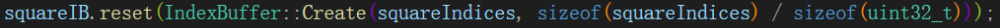
直接进入OpenGL实现方法中，方法如下：
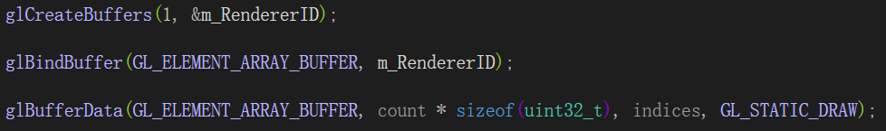

##### 绑定IBO

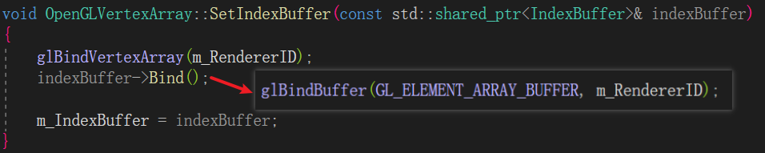

##### 创建默认白色Texture

代码如下，具体OpenGL层面不在扩展
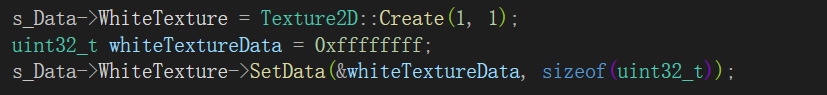

##### 绑定Shader

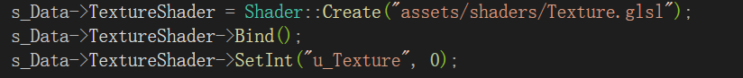
Shader创建
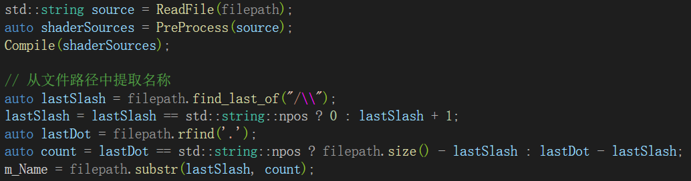
绑定
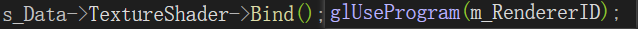
设置Shader数据
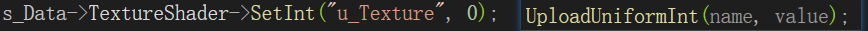

## 在Editor层中的渲染逻辑

在OnAttach该层时，首先会进行如下的初始化设置
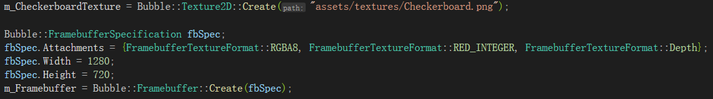

1. 为m_CheckerboardTexture加载实际的纹理
2. 填充FramebufferSpecification信息
3. 创建Framebuffer

## FrameBuffer的封装

### 成员：

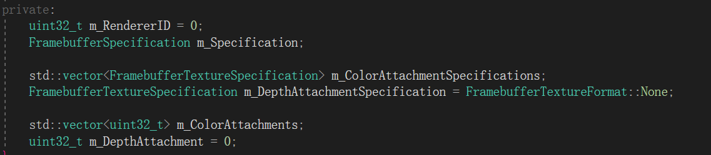

### FramebufferSpecification结构体

首先解析一下`FramebufferSpecification`这个结构体
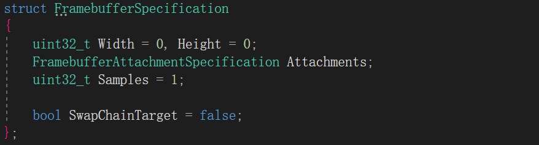
以及内部`FramebufferAttachmentSpecification`结构体：

`FramebufferSpecification`记录了Framebuffer的大小，多重采样，以及附件的格式
附件格式则是由一个vector存储，内部结构体为`FramebufferTextureSpecification`：
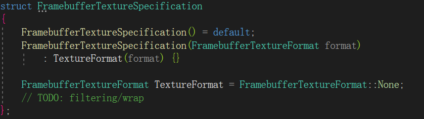
而FramebufferTextureFormat 实际上是一个枚举类，内容如下：
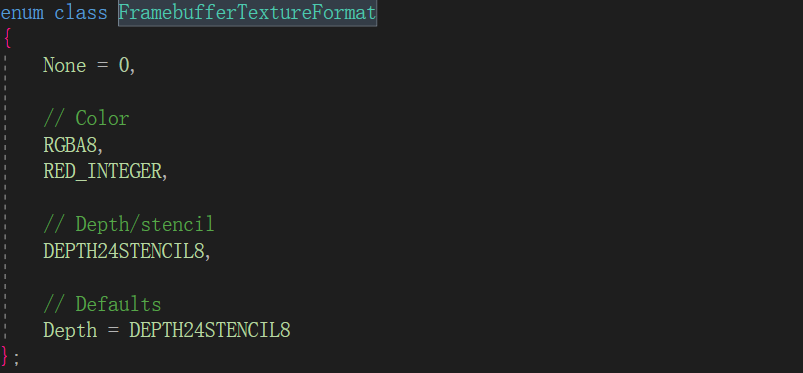
上面就是所涉及到的附件格式

### 构造函数：

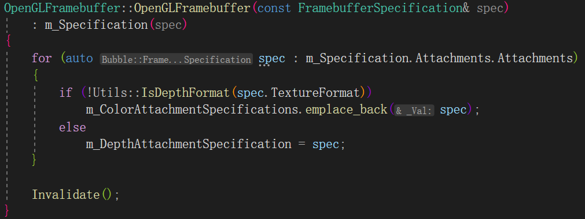

首先遍历附件格式，将其分为两种（颜色附件以及深度缓冲附件）
接下来调用Invalidate方法，该方法我们逐步分析

## Invalidate函数

### 清理已存在的framebuffer

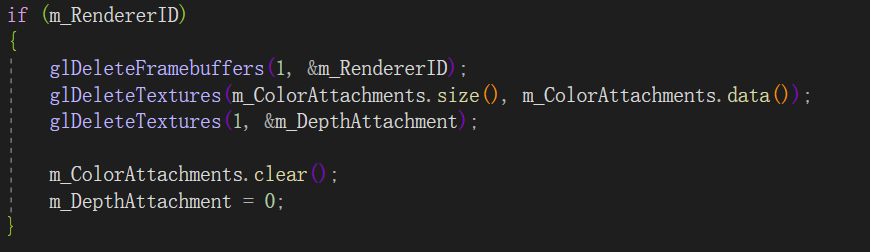

当framebuffer存在时，首先释放这个framebuffer

### 创建新的Framebuffer

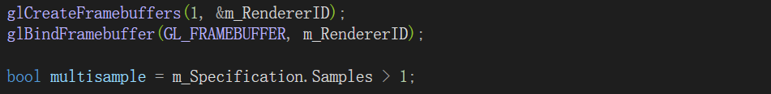

创建新的Framebuffer对象并标记一下是否开启多重采样

### 创建并绑定颜色附件的纹理

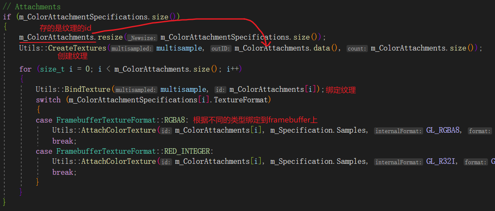

纹理创建实现如下：
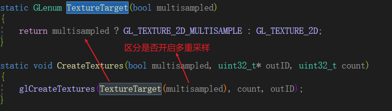

接下来绑定纹理

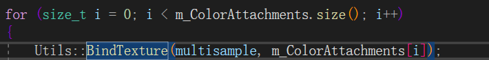

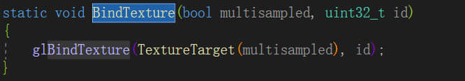

随后根据类型的不同将纹理附加到framebuffer上

AttachColorTexture的实现如下：

### 创建并绑定深度缓冲

逻辑跟颜色附件相同

### 设置渲染目标

### 结束，绑定空的Framebuffer

## 老版OenGL顶点数据传输方式

## Editor渲染流程

### 更新相机

## OpenGL渲染最基本流程

- 设置glViewport
- 